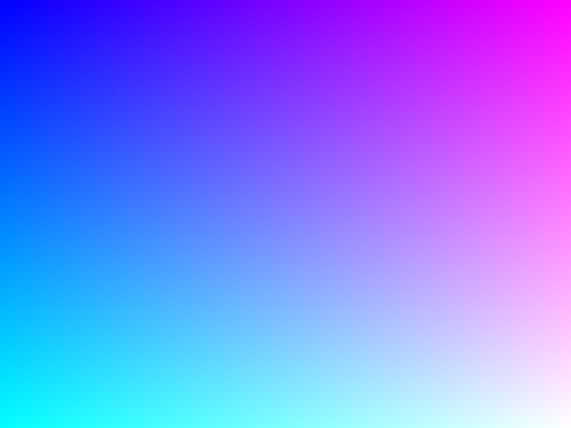
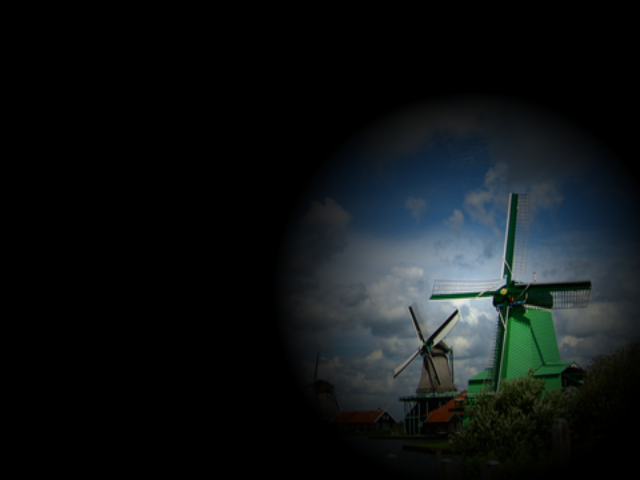
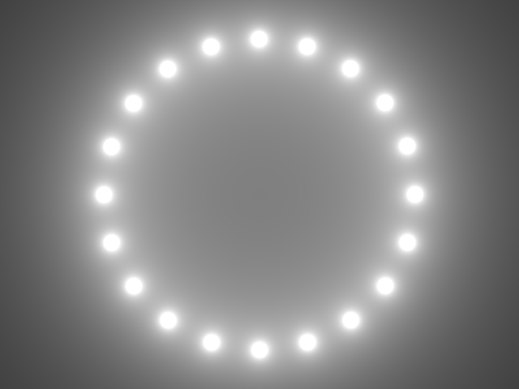
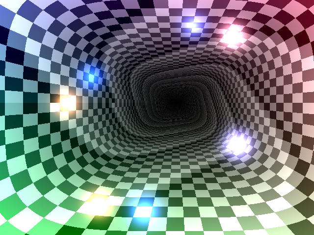

# SivShader

### 使い方
- Main.cpp と Shader.hlsl を Siv3D プロジェクトにコピー

### 操作
- HLSL ファイルを更新するとシェーダを更新
- 画像ファイルを画面にドロップするとテクスチャを更新
- スペースキーを押すと `g_time` をリセット

### シェーダ入力

|型|名前|説明|
|----|----|----|
|float2|g_resolution|ウィンドウの解像度|
|float|g_time|経過時間（秒）|
|float|g_frame|経過フレーム|
|float2|g_mouse|マウス座標|
|float|g_leftPressed|左クリック|
|float|g_rightPressed|右クリック|
|float2|g_textureResolution|テクスチャのサイズ|
|Texture2D|texture0|テクスチャ|
|SamplerState|sampler0|サンプラー|

### サンプルシェーダ 1

```cpp
float4 PS(float4 position : SV_POSITION, float2 uv : TEXCOORD0) : SV_Target
{
	return float4(uv, 1, 1);
}
```

### サンプルシェーダ 2

```cpp
float4 PS(float4 position : SV_POSITION, float2 uv : TEXCOORD0) : SV_Target
{
	float d = 1.0 - distance(position.xy, g_mouse) / 200;
	
	if (g_leftPressed)
	{
		d = (d > 0.0);
	}

	return float4(d, d, d, 1) * texture0.Sample(sampler0, uv);
}
```

### サンプルシェーダ 3

```cpp
float4 PS(float4 position : SV_POSITION, float2 uv : TEXCOORD0) : SV_Target
{
	const float2 p = (position.xy - g_resolution / 2) / min(g_resolution.x, g_resolution.y);
	
	float3 c = float3(0, 0, 0);
	
	for (int i = 0; i < 20; ++i)
	{
		const float x = 0.4 * cos(2.0 * 3.14 * i / 20);
		const float y = 0.4 * sin(2.0 * 3.14 * i / 20);
		c += 0.01 / (distance(p, float2(x, y))) * float3(1, 1, 1);
	}

	return float4(c,1);
}
```

### サンプルシェーダ 4

```cpp
// Endless Tunnel
// By: Brandon Fogerty
// bfogerty at gmail dot com
// http://glslsandbox.com/e#35101.0

static const float  HorizontalAmplitude = 0.80;
static const float  VerticleAmplitude = 0.80;
static const float  HorizontalSpeed = 0.90;
static const float  VerticleSpeed = 0.50;
static const float  ParticleMinSize = 1.76;
static const float  ParticleMaxSize = 1.71;
static const float  ParticleBreathingSpeed = 0.30;
static const float  ParticleColorChangeSpeed = 0.70;
static const float  ParticleCount = 7.0;
static const float3 ParticleColor1 = float3(9.0, 5.0, 3.0);
static const float3 ParticleColor2 = float3(1.0, 3.0, 9.0);

float3 checkerBoard(float2 uv, float2 pp)
{
	float2 p = floor(uv * 4.6);
	float t = fmod(p.x + p.y, 2.2);
	float3 c = float3(t + pp.x, t + pp.y, t + (pp.x*pp.y));

	return c;
}

float3 tunnel(float2 p, float scrollSpeed, float rotateSpeed)
{
	float a = 2.0 * atan2(p.y, p.x);
	float po = 2.0;
	float px = pow(p.x*p.x, po);
	float py = pow(p.y*p.y, po);
	float r = pow(px + py, 1.0 / (2.0*po));
	float2 uvp = float2(1.0 / r + (g_time*scrollSpeed), a + (g_time*rotateSpeed));
	float3 finalColor = checkerBoard(uvp, p).xyz;
	finalColor *= r;

	return finalColor;
}

float3 particles(float2 uv)
{
	float2 pos = uv * 2.0 - 1.0;
	pos.x *= (g_resolution.x / g_resolution.y);

	float3 c = float3(0, 0, 0);

	for (float i = 1.0; i < ParticleCount + 1.0; ++i)
	{
		float cs = cos(g_time * HorizontalSpeed * (i / ParticleCount)) * HorizontalAmplitude;
		float ss = sin(g_time * VerticleSpeed   * (i / ParticleCount)) * VerticleAmplitude;
		float2 origin = float2(cs, ss);

		float t = sin(g_time * ParticleBreathingSpeed * i) * 0.5 + 0.5;
		float particleSize = lerp(ParticleMinSize, ParticleMaxSize, t);
		float d = clamp(sin(length(pos - origin) + particleSize), 0.0, particleSize);

		float t2 = sin(g_time * ParticleColorChangeSpeed * i) * 0.5 + 0.5;
		float3 color = lerp(ParticleColor1, ParticleColor2, t2);
		c += color * pow(d, 70.0);
	}

	return c;
}

float4 PS(float4 position : SV_POSITION, float2 uv : TEXCOORD0) : SV_Target
{
	float timeSpeedX = g_time * 0.3;
	float timeSpeedY = g_time * 0.2;
	float2 p = uv + float2(-0.50 + cos(timeSpeedX)*0.2, -0.5 - sin(timeSpeedY)*0.3);
	float3 finalColor = tunnel(p, 1.0, 0.0);

	timeSpeedX = g_time * 0.30001;
	timeSpeedY = g_time * 0.20001;
	p = uv + float2(-0.50 + cos(timeSpeedX)*0.2, -0.5 - sin(timeSpeedY)*0.3);

	finalColor += particles(uv);

	return float4(finalColor,1);
}
```
